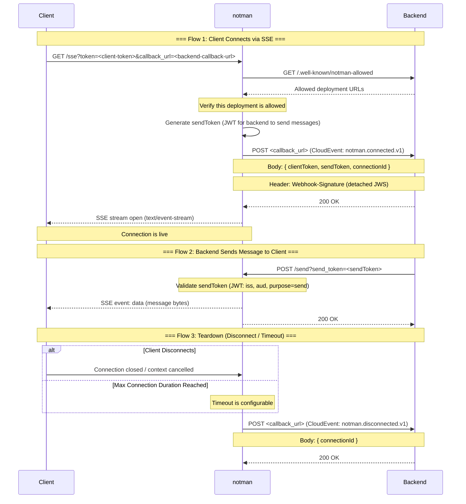

# notman
Tends to your clients persistant connection so that your backend doesn't have to.
Giving you the freedom to run your backend serverlessly while still offering your clients the possibility of live updates.

## Basic flow

