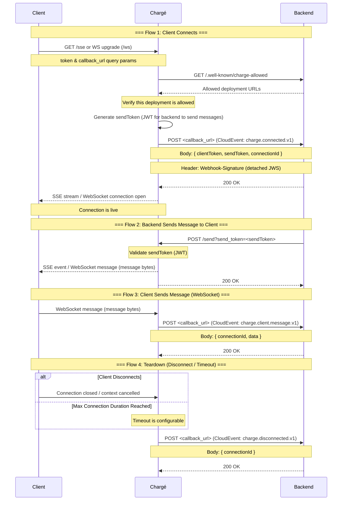

# Chargé [(d'affaires)](https://en.wikipedia.org/wiki/Charg%C3%A9_d'affaires) - Keeping your clients connected, while you are away.
Chargé tends to your clients' long-lived connections while you are away, giving you the freedom to run your service serverlessly while still offering your clients the possibility of e.g. live updates.

## Basic flow

